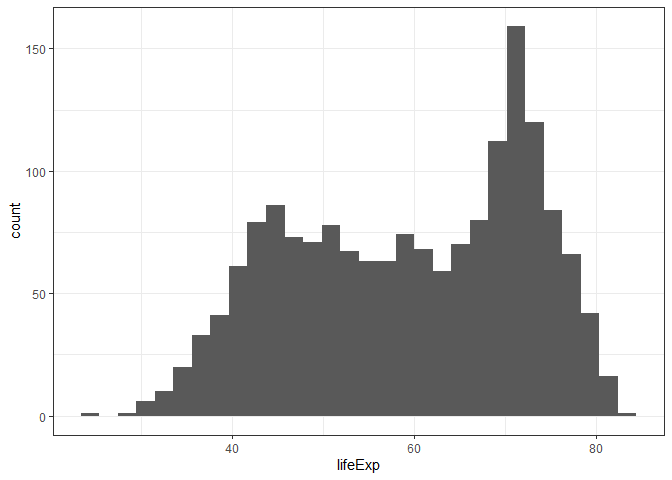
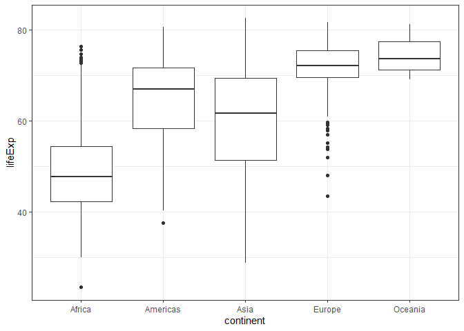
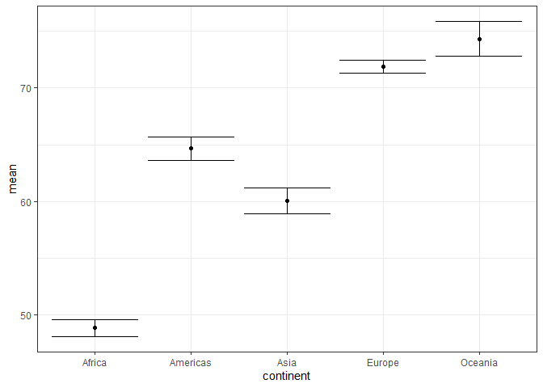
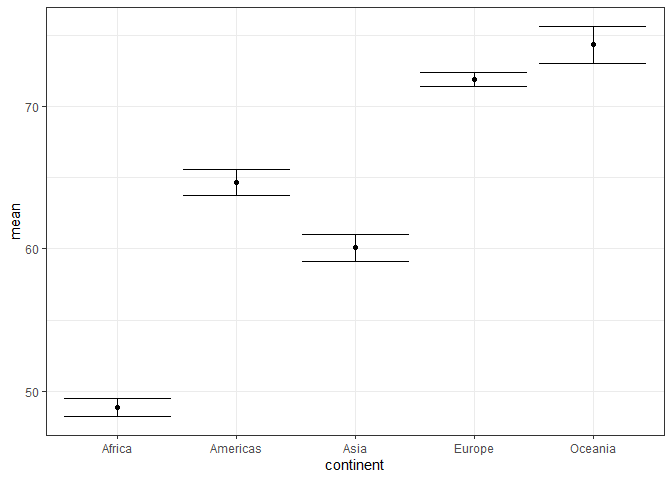

<!-- README.md is generated from README.Rmd. Please edit that file -->

# catexplore

<!-- badges: start -->
<!-- badges: end -->

The goal of catexplore is to help streamline the first steps of data
exploration for datasets with continuous response variables and
categorical explanatory variables. It produces exploratory analyses and
visualizations of data, using data wrangling and graphing tools from the
tidyverse, to make troubleshooting, cleaning, and pattern-checking data
quick and easy.

## Installation

catexplore is not on CRAN yet. You can download it from the
[GitHub](https://github.com/) repository using the following r command:

``` r
devtools::install_github("rghansen/catexplore")
```

## Example

This is a basic example which shows you how a function `cat_explore1()`
from the 1catexplore\` package takes a dataframe, including a continuous
response variable and a categorical explanatory variable, and outputs
summary tables (including maximum, minimum, median, range, mean,
standard deviation, standard error, and group size) and graphs (boxplot
and mean with confidence intervals).

``` r
#Loading package
library(catexplore)
#Loading example data from gapminder dataset
library(gapminder)
#Applying function to gapminder dataset, where lifeExp is the continuous response variable and continent is the categorical explanatory variable
cat_explore1(gapminder, lifeExp, continent)
#> [[1]]
#> `stat_bin()` using `bins = 30`. Pick better value with `binwidth`.
```



    #> 
    #> [[2]]
    #> # A tibble: 5 x 5
    #>   continent median   max   min range
    #>   <fct>      <dbl> <dbl> <dbl> <dbl>
    #> 1 Africa      47.8  76.4  23.6  52.8
    #> 2 Americas    67.0  80.7  37.6  43.1
    #> 3 Asia        61.8  82.6  28.8  53.8
    #> 4 Europe      72.2  81.8  43.6  38.2
    #> 5 Oceania     73.7  81.2  69.1  12.1
    #> 
    #> [[3]]



    #> 
    #> [[4]]
    #> # A tibble: 5 x 5
    #>   continent  mean    sd    se     n
    #>   <fct>     <dbl> <dbl> <dbl> <int>
    #> 1 Africa     48.9  9.15 0.366   624
    #> 2 Americas   64.7  9.35 0.540   300
    #> 3 Asia       60.1 11.9  0.596   396
    #> 4 Europe     71.9  5.43 0.286   360
    #> 5 Oceania    74.3  3.80 0.775    24
    #> 
    #> [[5]]



This is a special example which shows you how a function (cat_explore1)
from the catexplore package can be used to specify different sizes of
confidence intervals using the `alpha` argument. Functions default to
`alpha = 0.05`, producing 95% confidence intervals.

``` r
#Applying function to gapminder dataset as in previous example, but specifying alpha = 0.1 to produce 90% confidence intervals
cat_explore1(gapminder, lifeExp, continent, alpha = 0.1)
#> [[1]]
#> `stat_bin()` using `bins = 30`. Pick better value with `binwidth`.
```


    #> 
    #> [[2]]
    #> # A tibble: 5 x 5
    #>   continent median   max   min range
    #>   <fct>      <dbl> <dbl> <dbl> <dbl>
    #> 1 Africa      47.8  76.4  23.6  52.8
    #> 2 Americas    67.0  80.7  37.6  43.1
    #> 3 Asia        61.8  82.6  28.8  53.8
    #> 4 Europe      72.2  81.8  43.6  38.2
    #> 5 Oceania     73.7  81.2  69.1  12.1
    #> 
    #> [[3]]


    #> 
    #> [[4]]
    #> # A tibble: 5 x 5
    #>   continent  mean    sd    se     n
    #>   <fct>     <dbl> <dbl> <dbl> <int>
    #> 1 Africa     48.9  9.15 0.366   624
    #> 2 Americas   64.7  9.35 0.540   300
    #> 3 Asia       60.1 11.9  0.596   396
    #> 4 Europe     71.9  5.43 0.286   360
    #> 5 Oceania    74.3  3.80 0.775    24
    #> 
    #> [[5]]


